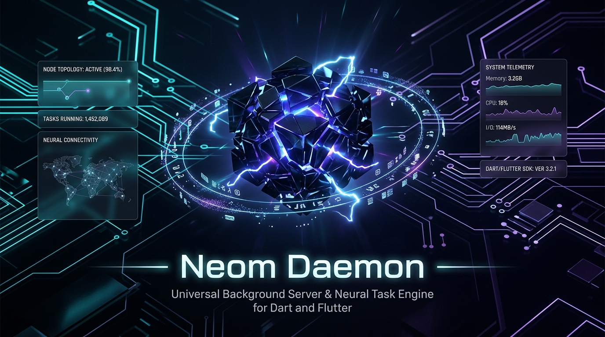

<p align="center">
  
</p>

# ⚙️ Neom Daemon (`neom_daemon`)

[](https://pub.dev)
[](https://dart.dev)
[]()
[]()

> **Neom Daemon** is a universal, open background server and autonomous task execution engine for **Dart & Flutter** applications in the **Neom Ecosystem** (Itzli, Neom DAW, PDF Readers, EEG Processors, Games, and VR/AR).

---

## 🌟 Why Neom Daemon?

Building background services, cross-device controllers, or local AI agent nodes in Flutter currently requires stitching together multiple unintegrated packages. **Neom Daemon** provides a turnkey, production-ready solution that turns any Dart or Flutter process into a secure background node server.

### Key Features
- 🔌 **Configurable Port Binding**: Run on the default port (`8392`), bind to any custom user-defined port, or specify port `0` for dynamic OS assignment.
- 🛡️ **Defense-in-Depth Security (`DaemonCommandRouter`)**: Built-in safety checks blocking dangerous system commands before execution.
- 📊 **Telemetry & Health Checks**: Exposes `/status` and `/health` JSON endpoints reporting CPU, RAM, active task count, and uptime.
- 🚀 **Decoupled Architecture**: Clean separation between server/host runtime (`neom_daemon`) and remote control client UI (`neom_rc`).
- ⚡ **Pure Dart Native Execution**: Extremely fast `dart:io` engine with zero heavy framework dependencies.

---

## 📦 Installation

Add `neom_daemon` to your `pubspec.yaml`:

```yaml
dependencies:
  neom_daemon:
    git:
      url: git@github.com:Open-Neom/neom_daemon.git
```

Or via pub.dev once published:

```yaml
dependencies:
  neom_daemon: ^0.1.0
```

---

## 🚀 Quick Start

### 1. Basic Server Startup (Default Port `8392`)

```dart
import 'package:neom_daemon/neom_daemon.dart';

void main() async {
  final daemon = NeomDaemonServer();
  final success = await daemon.start();

  if (success) {
    print('Neom Daemon running on port: ${daemon.port}');
  }
}
```

### 2. Custom Port Binding

```dart
void main() async {
  // Bind to a user-selected port (e.g. 9090)
  final daemon = NeomDaemonServer(port: 9090);
  await daemon.start(customPort: 9090);

  print('Neom Daemon running on custom port: ${daemon.port}');
}
```

### 3. Dynamic Port Allocation (OS Auto-Assign)

```dart
void main() async {
  // Pass port 0 to let the OS assign an available port automatically
  final daemon = NeomDaemonServer(port: 0);
  await daemon.start(customPort: 0);

  print('Neom Daemon active on dynamic port: ${daemon.port}');
}
```

### 4. Executing Commands Safely

```dart
void main() async {
  final router = DaemonCommandRouter();
  final result = await router.dispatch('git status');

  if (result.isSuccess) {
    print('Output:\n${result.stdout}');
  } else {
    print('Error:\n${result.stderr}');
  }
}
```

---

## 📐 Architecture: `neom_daemon` vs `neom_rc`

```
┌─────────────────────────────────────────────────────────────────────────┐
│                            NEOM ECOSYSTEM                               │
├────────────────────────────────────┬────────────────────────────────────┤
│            neom_daemon             │              neom_rc               │
│     (Server / Host / Runtime)      │     (Client / Remote Controller)   │
├────────────────────────────────────┼────────────────────────────────────┤
│ • Headless background service      │ • User remote control UI           │
│ • Local CLI & task execution       │ • QR Code Scanner & Handshake      │
│ • Hardware telemetry & health      │ • Virtual Touchpad & Voice Remote  │
│ • Configurable HTTP/IPC Listener   │ • Transport Adapters (Firestore)   │
└────────────────────────────────────┴────────────────────────────────────┘
```

---

## 🛣️ Roadmap

- [ ] **v0.2.0**: Automatic mDNS / ZeroConf service discovery (`_neom-daemon._tcp.local`).
- [ ] **v0.3.0**: Real-time WebSockets streaming for `stdout`/`stderr` logs and live telemetry (`/ws/logs`).
- [ ] **v1.0.0**: Declarative Security Sandboxing (`ReadOnly`, `RestrictedWorkspace`, `FullControl`).

---

## 📄 License

Distributed under the MIT License. See `LICENSE` for more information.
